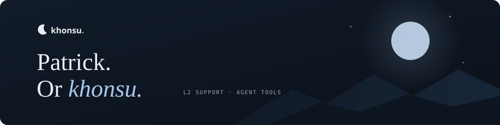

Hi, I'm Patrick. I build small tools and workflows around AI agents, with a focus on reusable skills and checking what agents actually did. My own projects are where I test what works and keep the failures easy to review.

By day I'm a **Customer Support Partner L2** at [Luigi's Box](https://www.luigisbox.com/), which builds search and product discovery for online shops. L2 is second-line technical support. I audit implementations, investigate browser and API behaviour, product feeds and analytics, and turn failures into cases engineering can reproduce.

[khns.dev](https://khns.dev/) has project notes, playable demos, a terminal and a multilingual chat guide. Its [source is public](https://github.com/khons-hu/portfolio) too.

### Current projects

| Project | What it is |
| --- | --- |
| [Khonsu Moonlight](https://marketplace.visualstudio.com/items?itemName=khons-hu.khonsu-moonlight) · [source](https://github.com/khons-hu/khonsu-moonlight) | A midnight-navy VS Code theme with seven optional interactive companions, reversible setup tools and matching Vim, Neovim and terminal colors. |
| [Feedcairn](https://relay.khns.dev/) · [source](https://github.com/khons-hu/feedcairn) | An RSS inbox for AI releases, with saved links, backups and an optional Jev reading order. |
| [Trialkeep](https://github.com/khons-hu/trialkeep) | Small, reproducible tests for agent decisions, browser tasks and instruction comparisons. Failures stay visible. |
| [Reasonrook](https://solve.khns.dev/) · [source](https://github.com/khons-hu/reasonrook) | Coding, debugging, logic and prompt exercises, with hints when you need them. |
| [Stakeglass](https://odds.khns.dev/) · [source](https://github.com/khons-hu/stakeglass) | A read-only Polymarket research desk. No trades or wallet connection. |
| [Receipts After Dark](https://yfm-po.itch.io/receipts-after-dark) | An early Godot browser game about inspecting evidence and making the call. |

Moonlight 0.8.0 gives all seven companions new artwork and refines the editor's hints, sticky scroll and focus outlines. [Screenshots and the 64-second demo](https://khns.dev/#project/khonsu-moonlight) · [Release notes](https://github.com/khons-hu/khonsu-moonlight/releases/tag/v0.8.0)

### How I work with agents

I build and review projects with Codex and Claude, reusable skills and MCP tools. The useful part is giving agents the right context and then checking the result. Jev helps with small structured decisions, like choosing between candidates or ordering retrieved context while keeping the sources. A model's suggestion and a verified action are different things, so I keep them separate.

I also write [practical model reviews on Unbenchmark](https://unbenchmark.com/user/khons-hu?tab=reviews). They cover coding, writing and small agent decisions, with the setup and limits included. The ratings reflect my own usage.

### Earlier work

Master's in Computer Science from TUKE, with a thesis on PPO agents for a multiplayer game and LLM-generated maps. I've also worked on language-learning games, card-personalization software and IBM DOORS NG extensions. [Dots](https://dots.khns.dev/) · [source](https://github.com/khons-hu/Dots) is a 2023 React and Spring Boot game, now playable in the browser. Older repositories are kept for reference and are not necessarily maintained.

---

[khns.dev](https://khns.dev/) · [LinkedIn](https://www.linkedin.com/in/patrick-obrtal/) · [X](https://x.com/ptr1337_) · [Steam](https://steamcommunity.com/id/khons_hu/) · [Unbenchmark](https://unbenchmark.com/user/khons-hu?tab=reviews) · Discord: khons.hu
